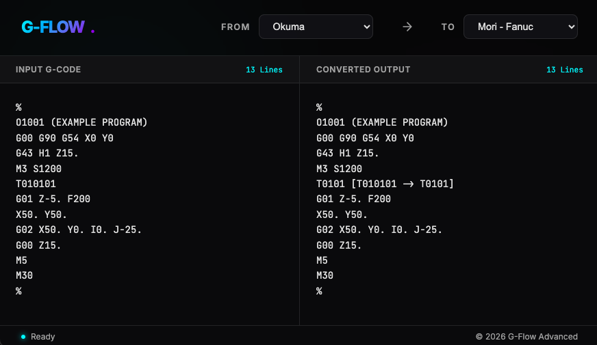

# G-Flow: Reaaliaikainen G-koodin muunnin / Real-Time G-Code Converter

**G-Flow** on korkean suorituskyvyn verkkosovellus, joka on suunniteltu kääntämään G-koodia eri CNC-standardien (esim. Fanuc, Okuma, GRBL) välillä reaaliajassa. Sovelluksen tyylikäs "Antigravity"-tumma teema ja selkeä käyttöliittymä takaavat nopean ja turvallisen konekoodin muokkauksen.

---

### ✨ Keskeiset ominaisuudet (FI)
* **Välitön muunnos:** Reaaliaikainen koodin kääntäminen koodia syötettäessä.
* **Muutosmerkinnät:** Selkeä seuranta tehdyistä muutoksista (esim. `T0101 [T010101 → T0101]`).
* **Neon-teemainen käyttöliittymä:** Ammattimainen lasimainen muotoilu, joka sopii konepajaympäristöön.
* **Ei riippuvuuksia:** Kevyt ja nopea toteutus puhtaalla JavaScriptillä.

---

**G-Flow** is a high-performance web application designed to translate G-code between CNC standards (Fanuc, Okuma, GRBL, etc.) in real-time. Built with a premium "Antigravity" dark-mode UI, it ensures safe and fast machine code adaptation.

---

### ✨ Key Features (EN)
* **Instant Conversion:** Real-time, debounced translation as you type.
* **Bracketed Annotations:** Clear change tracking (e.g., `T0101 [T010101 → T0101]`) for easy verification.
* **Neon-Dark UI:** Professional glassmorphism design optimized for shop-floor environments.
* **Zero Dependencies:** Lightweight vanilla JS for maximum speed and reliability.

### 🛠️ Tech Stack
* **Frontend:** HTML5, CSS3 (Glassmorphism & Neon accents)
* **Logic:** Vanilla JavaScript (Regex-based parsing engine)

### 🚀 Quick Start
1. Clone the repo.
2. Open `index.html` in any browser.
3. Select your source/target machines and paste your code.

---
*© 2026 G-Flow Advanced*
